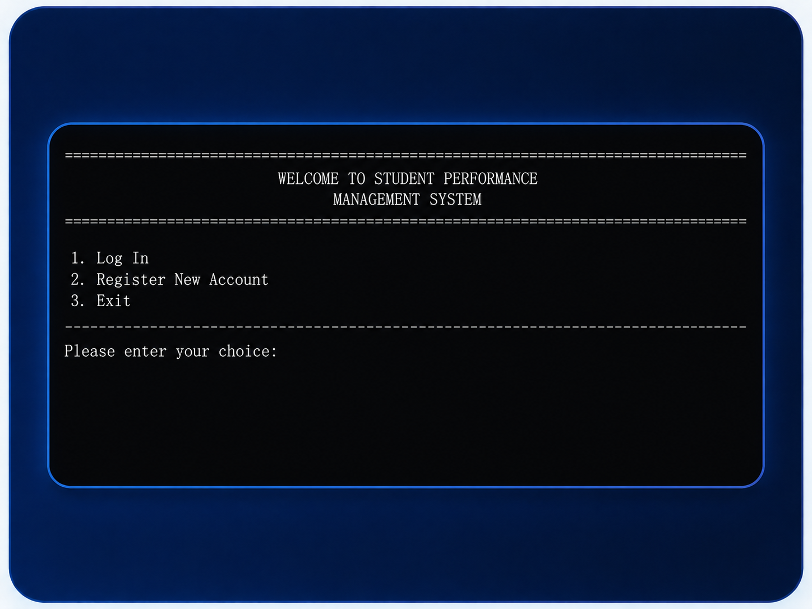
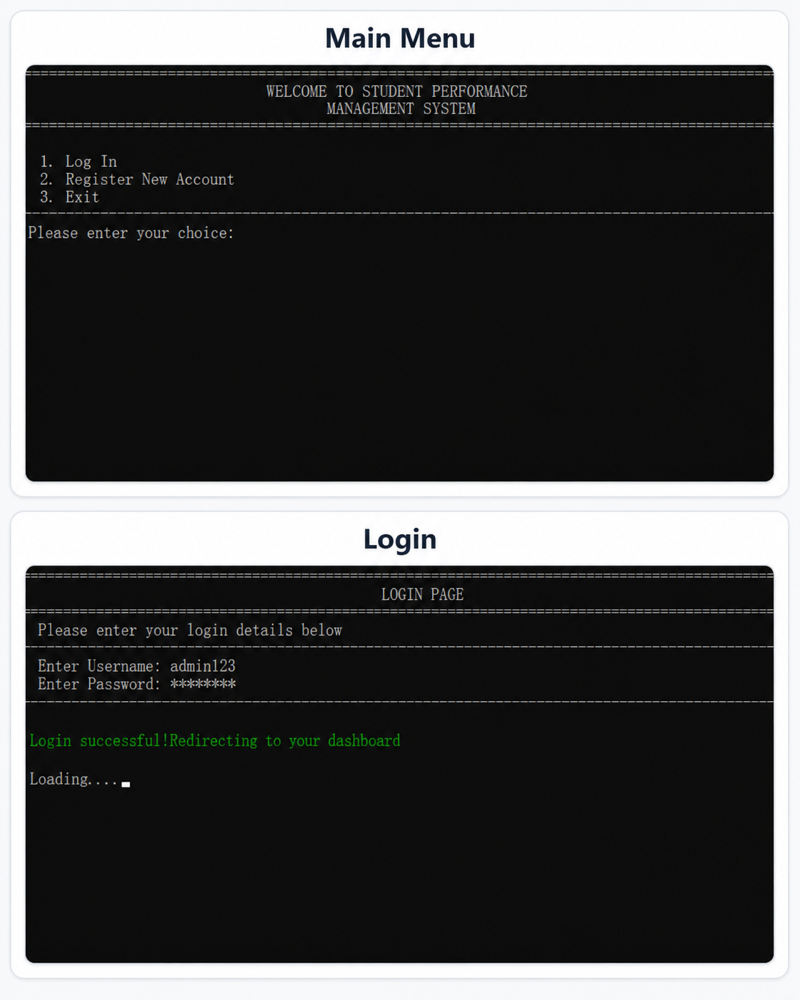
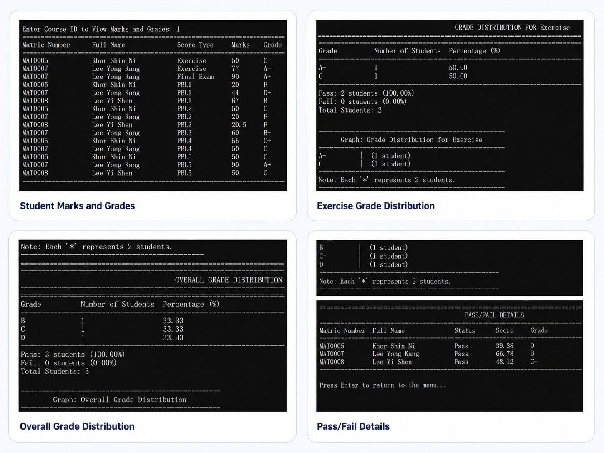

# 🎓 Student Performance Management System

## 📌 Overview

This project is a C++ based system designed to manage student performance records efficiently.

## ✨ Features

- 🔐 User login and registration system
- 👨‍🎓 Manage student information
- 📝 Input and update marks
- 📊 Automatic grade calculation
- 🔍 Search student records
- 🗄️ Database integration using MySQL

## 🛠️ Technologies Used

- 💻 C++
- 🗄️ MySQL

## 📂 Files

- `main.cpp` → source code
- `database.sql` → database structure

## 🎯 Purpose

This system is developed to improve efficiency in managing student data and reduce manual errors.

## 🖼️ Screenshots

### Main Menu

### Login Page

### Grade Analysis

